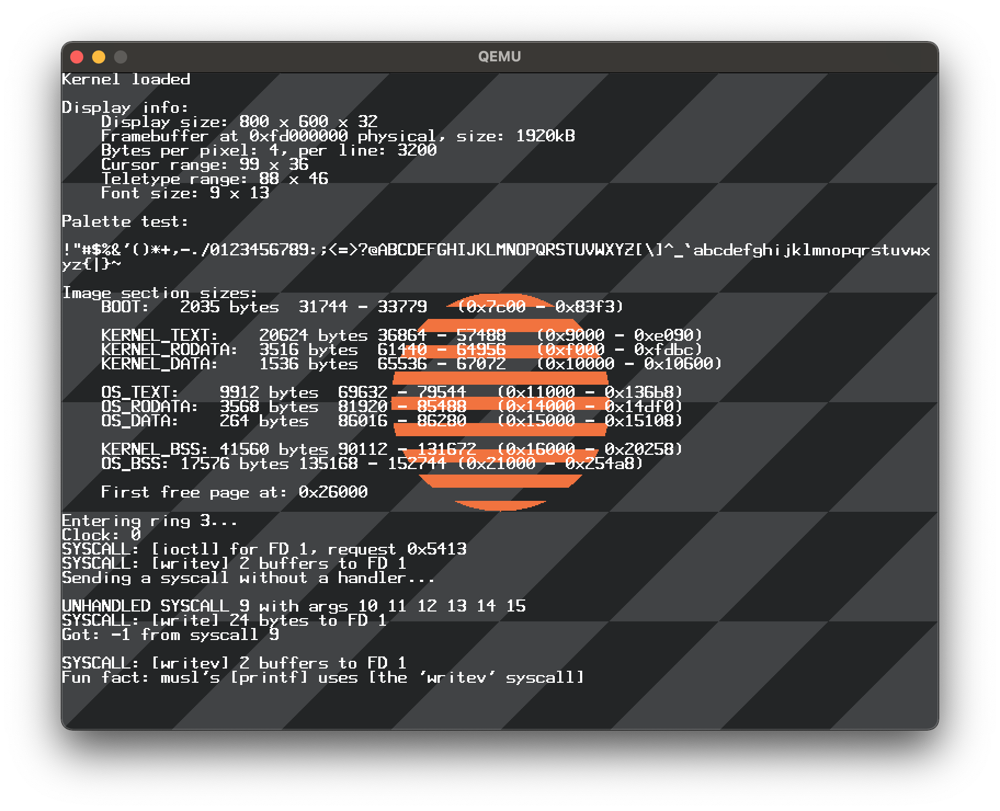

# Bootable stuff

**Work in progress.**

This repository contains a custom bootloader and an x86_64 kernel, both written from scratch.



# Running

Make sure you have the required dependencies:

- make
- nasm
- QEMU (qemu-system-x86_64)
- x86_64-elf-gcc
- x86_64-elf-ld

Then

```shell
make qemu64   # anywhere
make hvf      # on MacOS
```

to build the image and boot it in QEMU.

# Features

- Bootloader
    - [x] Protected mode
    - [x] Long mode
    - [x] Enabling SSE, AVX*
- VGA controller
    - [x] Printing text to the screen
    - [x] Setting VESA modes automatically
    - [ ] Graphics API
- Interrupts
    - [x] IDT setup with PIC remapping
    - [x] Event-based system for handing keyboard interrupts
    - [ ] Handling special keys and combinations (shift, backspace...)
    - [ ] Clock config (IRQ 0)
- Memory management
    - [ ] Handling page faults
    - [x] Physical memory manager
    - [x] Virtual memory manager
    - [x] Kernel heap management (`kmalloc`, `kfree`)
        - [x] Porting [liballoc](https://github.com/blanham/liballoc)
- Standard library
    - [ ] Porting an actual libc implementation

# Caveats

### AVX support

Provided that [XSAVE](https://wiki.osdev.org/SSE#XSAVE) is supported by the CPU, we can enable `AVX` within the kernel.
To do this, we enable the `avx` CPU feature in QEMU.

However, QEMU's [TCG](https://wiki.qemu.org/Features/TCG) cannot translate AVX instructions, and so they cannot be
emulated. This means that we cannot actually use AVX to vectorize kernel code. Attempting to compile the kernel
with `-mavx` will result in a **General Protection Fault**.

### HVF acceleration

On MacOS, it is possible to run the kernel with Hypervisor acceleration. However, `qemu-system-x86_64` on Mac does not
allow unsigned binaries to use it.

To sign the QEMU binary, run the following command from repository root:

```shell
codesign -s - --entitlements qemu/app.entitlements --force "$(command -v qemu-system-x86_64)"
```

Note that the HVF in QEMU **does not support SSE**. Do not compile with `-O3` if you want to use the `hvf` target.