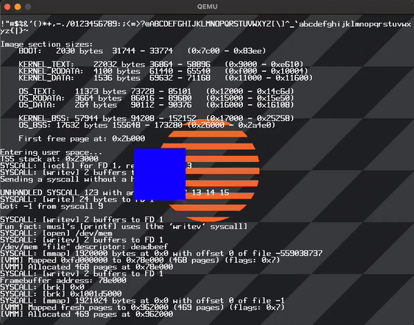

# Bootable stuff

**Work in progress.**

This repository contains an x86 bootloader and kernel written from scratch.

The main goal is to learn x86 assembly and OS/kernel programming.

## Running

Install these dependencies:

- nasm
- qemu-system-x86_64
- i386-elf-gcc

Then

```
make run
```

to build the image and boot it in QEMU.

## Current state

